# WordClock
A clock that tells time in plain text. In Dutch, e.g. "TIEN OVER HALF TWAALF".

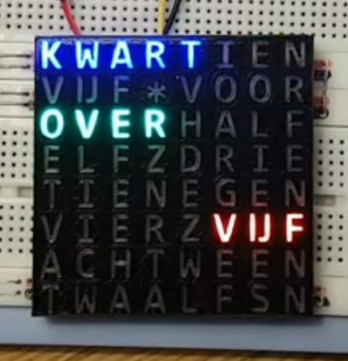

Commercial [products](https://qlocktwo.com/) exist, but I'm making my own. 
There is a [video](https://youtu.be/0UkmPO7tGsg) looking at the mechanics,
and a [video](https://youtu.be/4AUioVwlsqg) comparing it to a DCF77 clock.

Here are some demos of animations ["none"](https://youtu.be/OCgUQ6qWnN4),
["wipe"](https://youtu.be/U9yd8xaslh4),
["dots"](https://youtu.be/AXKME2LGA_A),
["pulse"](https://youtu.be/F0VIralrmUM), and
["mist"](https://youtu.be/u285F07go_c).


## Table of contents

 - [1. Introduction](#1-Introduction) - What is this project about
 - [2. Model 1](#2-Model-1) - My first experiment
 - [3. Model 2](#3-Model-2) - Improved lettering
 - [4. 3D printing](#4-3D-printing) - 3D printed lettering
 - [5. NeoPixel power](#5-NeoPixel-power) - How much power is needed for NeoPixels
 - [6. Model 3](#6-Model-3) - Using the 3D printed lettering
 - [7. Keeping time](#7-Keeping-time) - How to keep time with NTP
 - [8. Timing](#8-Timing) - Disable interrupts disables time keeping
 - [9. Power architecture](#9-Power-architecture) - How to provide power to the NeoPixels
 - [10. Modding the board](#10-Modding-the-board) - Selecting an ESP8266 board
 - [11. Model 4](#11-Model-4) - Assembling the electronics and 3D printed case
 - [12. Model 5](#12-Model-5) - Adding the time keeping software
 - [13. Model 6](#13-Model-6) - End-user application "WordClockFull"
 - [14. User manual](#14-User-manual) - The user manual of "WordClockFull"

Notes
 - There are several [Arduino sketches](sketches) used during development.
 - There are some [Python scripts](scripts) used during development.


## 1. Introduction

I had seen WordClocks before, e.g. [here](https://www.instructables.com/id/My-Arduino-WordClock/).
However, doing the mechanics for 100 LEDs, isolating them (light bleed), wiring them - too much work.

Then I stumbled on a simpler [version](http://www.espruino.com/Tiny+Word+Clock).
It uses an 8×8 LED matrix, so very little mechanics to do.
The downside is that 8×8 LEDs means we are very restricted on the _lettering_: 
which letters (words) are placed where and how.


## 2. Model 1

I want a Dutch word clock.
I do not like vertical text. Is it possible to fit all this on 8×8?

For the hours, we need words `een` (1) to `twaalf` (12). That is 48 characters - note we are writing `vijf`, not `vijf`.
This means that we can not have words for all 60 minutes. Let's try to go for multiples of 5 only.
In Dutch this means `vijf` (`over`), `tien` (over), `kwart` (over), tien (`voor` half), vijf (voor half), `half`, vijf (`over` half), etc.
That is 24 characters.

Oops, 24+48 is 72, and we only have 64. 
But we can save a bit, for example, for `tien` and `negen`, we only need `tienegen`.

For my first prototype, I made a graph, coupling first letters to last letters of words. I started with the minutes:


We can only save 1 character, but that doesn't help, we go from 24 to 23. But 24 is 3 rows, and saving one character 
on the last row doesn't help, we can not fit an hour there.

Two solutions are shown below. They fit in three rows.
```
  vijfkwart     kwartien
  tienvoor     vijf_voor
  overhalf     overhalf
```

Note that `vijf`, `tien`, and `kwart` need to come before `over` and `voor`, and only then we can have `half`.
So there is not much room for alternatives.

Let's next look at the hours. They need to come after the minutes.
The complete graph is shown below.


We have a problem. Full words require 48 characters. We can, at best, save 5, which still requires 43. 
But we only have 40 (5 rows of 8), so we need to get rid of 3 more characters.

I cheated in my first prototype: two paired letters vIEr and twaaLF, and one split word Z-E-S. 
There are also some minor problem: two times a space missing (between `tien` and `voor`, and between `over` and `half`) 
and the word `uur` missing (for every full hour).

This is my first attempt.


The first prototype was made with an ESP8266, and an 8×8 LED matrix.
The wiring is straightforward:


I made a [video](https://www.youtube.com/watch?v=YDhCZarNm9g) that runs 
at approximately 600× so that all states appear in a one minute movie.

I also made a [real clock](sketches/WordClockLed) and a
[video](https://youtu.be/wVqeRSxwd_Y) that captures one state change.
This really keeps the time (based on the ESP8266 crystal).
At startup the user can press the FLASH button to set the hour and minute.


## 3. Model 2

Marc relaxed the rules, he allows diagonal words. He wrote a solver algorithm and found the below lettering solution.


This eliminates the paired letters and split words. Still a missing space, and still `uur` missing.

My next prototype uses Marc's lettering. It is supported by the same [sketch](sketches/WordClockLed) as the first prototype.

At startup you can not only set hour and minute, but also mode: clock or a fast demo.
Here is the [video](https://www.youtube.com/watch?v=LO9IB6KRluM) of the fast mode.


## 4. 3D printing

The good thing of the [8×8 LED matrix](https://www.aliexpress.com/item/32681183937.html) is that hardly any mechanics are needed. 
The downside of the 8×8 LED matrix, is that the 8×8 matrix is small, in my case 32×32 mm².

However, there are also [8×8 NeoPixel boards](https://www.aliexpress.com/item/32671025605.html).
Twice as big (65×65 mm²), fully assembled and still affordable.
On top of that: the LEDs are full RGB and only a single wire to control all LEDs.

This NeoPixel matrix is big enough to allow the clock to be 3D printed.
I used a printer with two heads. The first head prints the black encasing, the second head prints a 
transparent diffuser (also _inside_ the letters). The [design](https://a360.co/2R9Nksa) is made in Fusion 360.

I was quite pleased with the result. The print resolution is sufficient to print the letters. 
And the transparency is enough to see through.

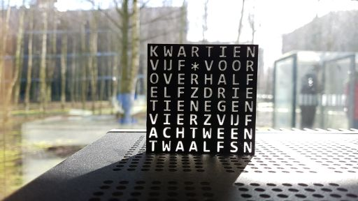

I did not yet receive the NeoPixel matrix from AliExpress, so I had to guess where to leave a notch for the resistors.

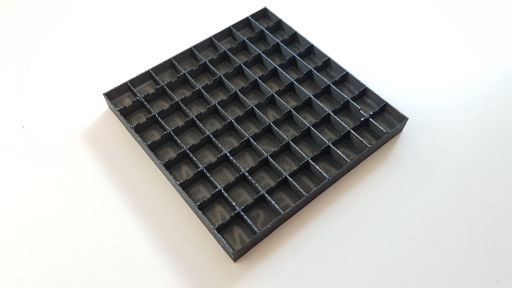


## 5. NeoPixel power

One thing that worries me about the NeoPixels is power usage. I tasked myself with measuring it.

It is helpful to understand the inner workings of a NeoPixels.
It contains a controller and three LEDs.

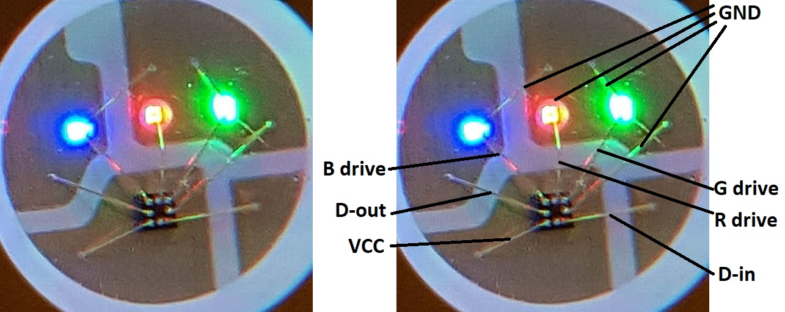

I did have a 4×4 NeoPixel board, and I investigated the power usage on that board.
I measured the current when 1 NeoPixel is red (0xFF0000). I measured also for 2, 3, ... 16 NeoPixels.
I measured the current when 1 NeoPixel is red but dimmed a bit (0xBF0000), and also for 2, 3, ... 16 NeoPixels.
I measured the red at half brightness (0x7F0000) and at quarter brightness (0x3F0000), for 1 to 16 NeoPixels.
All these experiments use just the red LED in the NeoPixel, so for the next two experiments I used the other
two LEDs in the NeoPixels: green (0x00FF00) and blue (0x0000FF) for 1 to 16 NeoPixels.
Finally I measured when more than 1 LED is on: purple (0xFF00FF) and white (0xFFFFFF).

All in all, 8 experiments, each with 1 to 16 NeoPixels.
The [script](sketches/NeoPixelAmps) was short, but doing all the measurements took quite some time.
I manually logged all [results](sketches/NeoPixelAmps/NeoStats.txt), and then tabulated them in Excel:

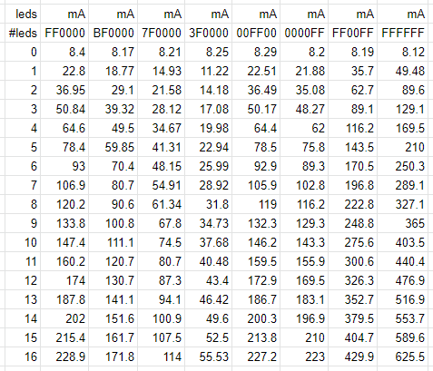

Here is the usage graphed:

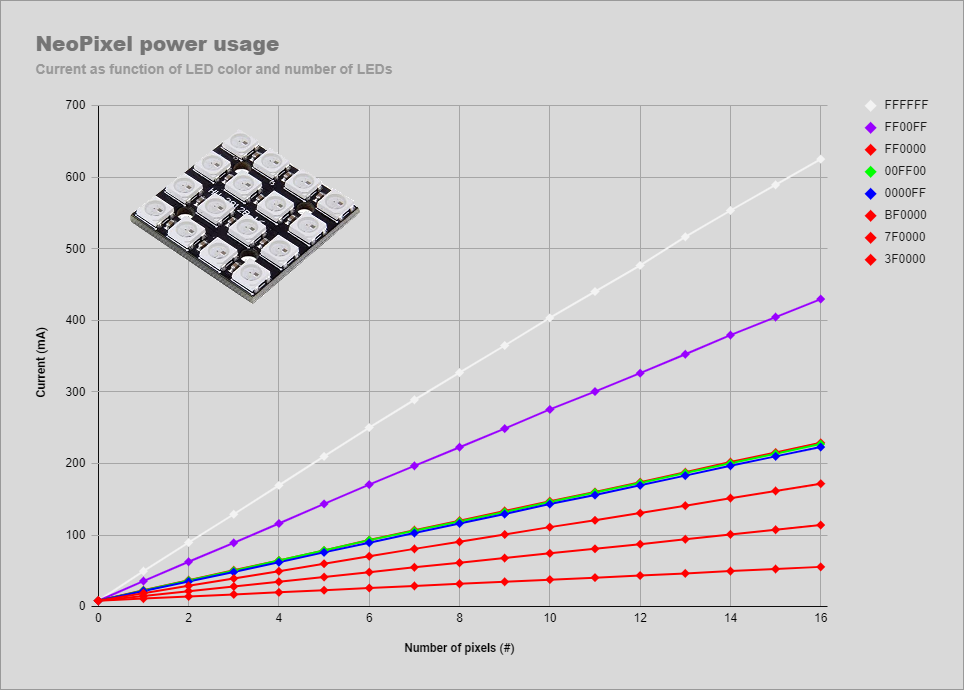

Conclusions: 
 - There is a off current of 8 mA (0.5mA per NeoPixel), probably due to the controllers in the 16 NeoPixels
 - A NeoPixel LED consumes 12.9mA when fully powered (0xFF).
 - The power usage of a NeoPixel LED is linear in the control value (00..FF).
 - The power usage of a NeoPixel sequence is linear in the number of NeoPixels switched on.
 - A 4×4 at full white (0xFFFFFF) thus consumes 16x3x12.9 + 16x0.5= 627 mA
 - A 8×8 at full white will likely consume 64×3×12.9 + 64×0.5 = 2509 mA or 2.5 A.


## 6. Model 3

Finally, I received the NeoPixels matrix.


Unfortunately, the resistors are not centered.
Also the matrix is not equal in horizontal and vertical direction: 
in horizontal direction the spacing is ~8.1mm and in vertical direction the spacing is ~8.3mm.
Result: he 3D print does not fit well.
I needed to make a new [3D model](https://a360.co/2RQO6uB).

See below for the wiring; the resistor is 470 Ω, the capacitor 1000 µF 
(see [Adafruit](https://learn.adafruit.com/adafruit-neopixel-uberguide/basic-connections)).
Note: The Neopixels run at 5V0, and the required signal level is at 70%, or 5V0 × 70% = 3V5.
Since the ESP8266 runs on 3V3, we are actually below spec.

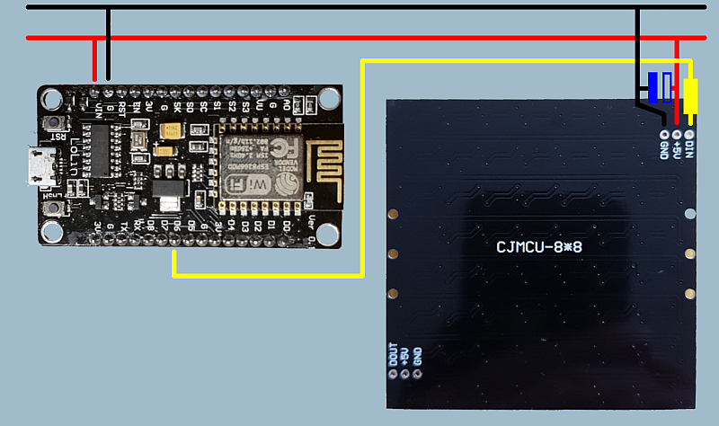

I adapted the [software](sketches/WordClockNeo) and did a try-out. 

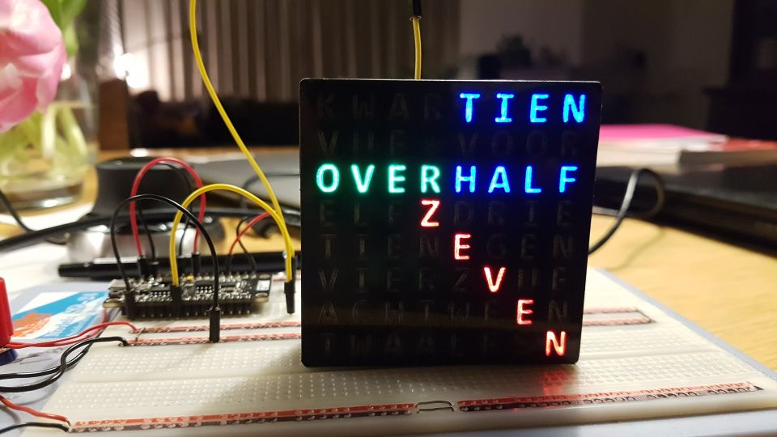

I made a [video](https://youtu.be/TlJQuVb-GIA) of it.


## 7. Keeping time

Now that the NeoPixel solution with 3D printed enclosure seems to work, we needed to tackle the next biggest problem.
Keeping track of time. There are several solutions:

 - Hand set the time, and use the built-in CPU crystal  
   Plus: No extra components needed.  
   Minus: Needs hand setting. Does not know about daylight saving time ("DST").
 - Use a [DS1307](https://www.aliexpress.com/item/32827794525.html) or [DS1302](https://www.aliexpress.com/item/32728498431.html) time tracking chip  
   Plus: Keeps time, even when not mains powered (small battery).  
   Minus: Needs hand setting once and does not know about daylight saving time.   
 - Use time stamp from webservers (e.g. http HEAD of google.nl)  
   Plus: No extra components needed (assuming ESP8266), no hand setting needed.  
   Minus: Web servers publish UTC, not local time. So adaptations for time zone and DST needed.
 - Use NTP servers  
   Plus: Servers are made for it. No extra components needed (assuming ESP8266), no hand setting needed.  
   Minus: NTP servers publish UTC, so again, adaptations for time zone and DST are needed.

When I found out the ESP8266 `<time.h>` actually includes NTP
and that the implementation has a single string parameter to configure time zone as well as DST,
I decided to use the last solution.

It basically boils down to telling `<time.h>` which NTP servers to use and what the timezone and DST configuration is.
Actually up to three servers can be passed. The timezone and DST configuration is passed as the first parameter:

```
  configTime(TZ, SVR1, SVR2, SVR3);
```

The first parameter (`TZ`) is a quite compact string. As an example, let's examine the string for Amsterdam.

```
  #define TZ "CET-1CEST,M3.5.0,M10.5.0/3" // Amsterdam
```

The first part of this string, before the comma, defines the (standard) timezone and the daylight saving timezone.
In the example, the (standard) timezone is known as `CET`, and you need to subtract 1 (`-1`) to get to UTC.
The daylight saving timezone is known as `CEST`, and since it is not explicitly included, 
it defaults to one (`1`) on top of the standard time.

After the comma we find the start moment of the daylight saving period: it starts at month `3` (March), week `5`, on Sunday (day `0`).
The `M` tells that the month, week, day notation with `.` is used.
After the next comma, we find when daylight saving stops: at month `10` (October), week `5`, day `0` (Sunday).
Also here in `M` and `.` notation.
The start is at 02:00:00 (default), the stop is explicit at 03:00:00 (`/3`).

See the [source](sketches/TimeKeeping) for more 
[details](https://github.com/maarten-pennings/WordClock/blob/master/sketches/TimeKeeping/TimeKeeping.ino#:~:text=TZ%20specification,end) 
on this string. The easiest way to play with this yourself is to change the string so that the timezone change (to or from DST)
is a couple of minutes from now. For this it is good to know that you can enter `M3.5.0/17:34`.

Here is the output of the script
```
time-keeping - NTP with TZ and DST
Not yet synced - 1970-01-01 09:00:00 (dst=0)
Not yet synced - 1970-01-01 09:00:01 (dst=0)
Not yet synced - 1970-01-01 09:00:02 (dst=0)
Not yet synced - 1970-01-01 09:00:03 (dst=0)
SET
2020-02-17 12:43:48 (dst=0)
2020-02-17 12:43:49 (dst=0)
2020-02-17 12:43:50 (dst=0)
2020-02-17 12:43:51 (dst=0)
2020-02-17 12:43:52 (dst=0)
2020-02-17 12:43:53 (dst=0)
2020-02-17 12:43:54 (dst=0)
2020-02-17 12:43:55 (dst=0)
2020-02-17 12:43:56 (dst=0)
2020-02-17 12:43:57 (dst=0)
2020-02-17 12:43:58 (dst=0)
2020-02-17 12:43:59 (dst=0)
DEMO >>> WiFi off: time continues
2020-02-17 12:44:00 (dst=0)
2020-02-17 12:44:01 (dst=0)
2020-02-17 12:44:02 (dst=0)
2020-02-17 12:44:03 (dst=0)
2020-02-17 12:44:04 (dst=0)
DEMO >>> Clock reset: time continues from reset val
SET
Not yet synced - 2000-11-22 11:22:34 (dst=0)
Not yet synced - 2000-11-22 11:22:35 (dst=0)
Not yet synced - 2000-11-22 11:22:36 (dst=0)
Not yet synced - 2000-11-22 11:22:37 (dst=0)
Not yet synced - 2000-11-22 11:22:38 (dst=0)
DEMO >>> WiFi on: time syncs again
Not yet synced - 2000-11-22 11:22:39 (dst=0)
Not yet synced - 2000-11-22 11:22:40 (dst=0)
Not yet synced - 2000-11-22 11:22:41 (dst=0)
SET
2020-02-17 12:44:14 (dst=0)
2020-02-17 12:44:15 (dst=0)
2020-02-17 12:44:16 (dst=0)
2020-02-17 12:44:17 (dst=0)
... many lines deleted
2020-02-17 13:44:10 (dst=0)
2020-02-17 13:44:11 (dst=0)
2020-02-17 13:44:12 (dst=0)
2020-02-17 13:44:13 (dst=0)
SET
2020-02-17 13:44:15 (dst=0)
```


 - At first, the time is not yet set, so we get "random" value (probably the date/time corresponding with value 0).
   My sketch uses the heuristic that any time before 2020 means 'not synced'.
   Note that the time keeping (stepping a second every second) happens, even though the time has not yet been SET.
 - It takes 5 seconds before we receive the first message from one of the NTP servers. 
 - At 2020-02-17 12:43:48, an NTP message arrives (see the SET). The time is known.
   Since 17 Feb is before DST start "month 3 (March), week 5, on Sunday (day 0)", daylight saving is indeed off `(dst=0)`.
 - At around 12:44:00 the script executes a test: it switches off WiFi.
   The time is maintained by the CPU (probably: crystal, timer, interrupt).
   So even without network, time is kept.
 - At 12:44:05 a second test kicks in.
   The local clock is hand written to 2000-11-22 11:22:33.
   Note the SET popping up, this time caused by hand-setting, not an NTP message.
   Since there is no WiFi, the hand-set time is maintained.
 - At 12:44:10 WiFi is switched on (step 3 of the test). 
   Since there is not an immediate NTP message, the old hand-set time is still maintained.
 - At 2020-02-17 12:44:14 an NTP message is received.
   The clock is back to real time, and locally maintained.
 - Note that one hour later (2020-02-17 13:44:14) the system (asks for and) receives the next NTP message.
   See the SET. The local clock is synced.

All in all, we have a firm basis for having an accurate time.


## 8. Timing

NeoPixels are controlled via a single serial line. One NeoPixel has three LEDs (red, green and blue), whose brightness
can be controlled from 0..255. So to configure one NeoPixel, it needs to be send 3×8 bits. Since there is no clock, 
biphase encoding is used: every bit uses a low and a high signal, so every bit has an edge (actually two). The
[datasheet](https://cdn-shop.adafruit.com/datasheets/WS2812.pdf) shows this picture of biphase encoding:

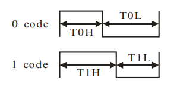

I did an experiment where I configured one NeoPixel, to have color `0x81c1e1` (that is red 0x81, green 0xc1, and blue 0xe1). 
I captured the clock signal on my logic analyser.

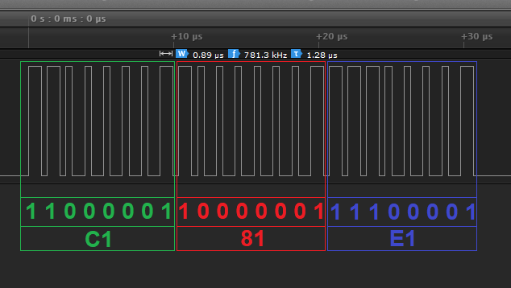

We notice the following

 - The bit clock is ~781kHz, which is close to the 800kHz from the documentation.
 - Note that the measured T1H is 0.89 µs, seems out of spec. It should be 0.7µs ± 150ns, that is 550ns..850ns, so 890 is too long.
 - The protocol is simple: the 3×8 bits are send, no overhead bits.
 - One NeoPixel thus takes 24/800k = 30µs to configure.
 - Pixel timing is confirmed in the capture: the whole transmission takes just over 30µs.
 - The bits are send MSB first, but in an unconventional order: GRB.
 - The [datasheet](https://cdn-shop.adafruit.com/datasheets/WS2812.pdf) confirms the order
   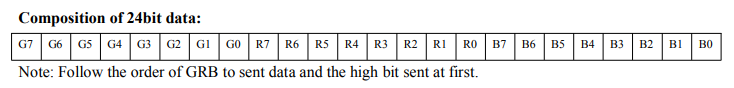.

Next experiment is to send an RGB value to all 64 NeoPixels. This is my capture.

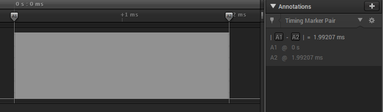

On this zoom level we can no longer see the indvidual bits. But sending 24 bits to each of the 64 neoPixels is expected to take
30µ × 64 = 1.92 ms. The capture confirms this: 1.99 ms.

Why is this relevant?
On the ESP8266, this string is bit-banged: all bits are generated by software. 
That is feasible: each bit is ~1µs, and the ESP8266 runs on 80MHz (say 80 instructions per µs).
However, it should not service an interrupt half-way.
For this reason, the NeoPixel library seems to disable interrupts.
This means that during an update of the 64 NeoPixel string, interrupts are disabled for 2ms.
During this 2ms, all interrupts are disabled, so `millis()` might miss ticks.

How realistic is this problem?
I found this [topic](https://forums.adafruit.com/viewtopic.php?f=47&t=42720#p212310).
It states that there is a timer interrupt every 1 ms, so if the disable-interrupt-time is 2ms
we miss interrupts and thus have clock drift. And 64 NeoPixels need about 2ms without interrupts.
So again. Are we at risk?

It seems that the above discussion is for plain Arduinos; the situation for the ESP8266 is a bit different.
It has a function `micros_overflow_tick()` which seems to be called periodically.
It seems to _monitor_ a hardware timer `system_get_time()` for overflows.
If there is an overflow, it increments a variable `micros_overflow_count`.
Check the code on your PC, or 
[here](https://github.com/esp8266/Arduino/blob/d990ff9547cf1bea7f91f3e3ad2c2eb8066c698f/cores/esp8266/core_esp8266_wiring.cpp#L61).

The function `millis()` uses `system_get_time()` and `micros_overflow_count` to
[compute](https://github.com/esp8266/Arduino/blob/d990ff9547cf1bea7f91f3e3ad2c2eb8066c698f/cores/esp8266/core_esp8266_wiring.cpp#L175)
the elapsed milliseconds.

So, can the ESP8266 also lose time?
For that it needs to lose a tick on `micros_overflow_count`.
It loses that when `system_get_time()` overflows without `micros_overflow_tick()` having been called.
It seems that `system_get_time()` counts micro seconds and it has a range of 32 bits.
So `system_get_time()` overflows every 2³² µs or 1.2 hour.
I expect the monitor function `micros_overflow_tick()` to be called much more frequently (say every second).
So losing one interrupt causes no harm at all, there would be 3599 to detect the overflow.

My guess is that on ESP8266 we do not suffer from losing time.
Marc did an experiment, continuously flashing NeoPixels, and indeed found no time drift.


## 9. Power architecture

We are going to use an ESP8266 for the WordClock. ESP8266s are easily and cheaply available, and they have WiFi.
That allows us to use NTP (time syncing) which makes them well suited for maintaining time for our clock.

The ESP8266 runs on 3V3, but typically comes on boards that are powerd via USB (and thus 5V).
These boards have a voltage regulator that converts 5V to 3V3. The boards also have a VIN that 
connects to the regulator. This allows us to use an external power supply (6V-12V) instead of 
power over USB.

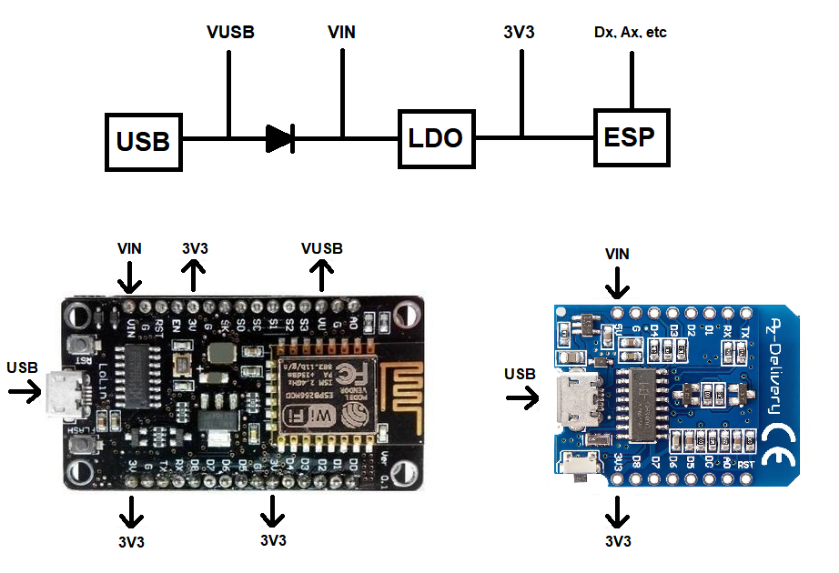

Note that there is a diode between the USB port and VIN. 
If you would externally power the NodeMCU board via VIN (say 9V), and you would also have connected the
USB port to a PC (e.g. for debugging using the Serial port) the external 9V would also be on the PCs USB port, 
possibly damaging it. The diode protects your PC's USB port against over-voltage.

There is an extra effect: the diode has a voltage drop. Typically, a Schottky diode is used, which has 
a voltage drop of only 0.3V. So if you plug in USB (5V), the voltage regulator has 4V7 as input, which is still
enough to have 3V3 out. The side effect is that VIN will be at 4V7.

The NeoPixels need 5V. It would be easiest to tab that from the USB port. Some boards do have a pin for that.
I call it VUSB in the diagram above. However not all (big) boards do have a VUSB pin, and the smaller boards 
typically never have one. 

We could use VIN as _output_ instead of _input_, and power the NeoPixels with VIN. 
This means the NeoPixels run on 4V7, which is acceptable.
That level is actually interesting, because the NeoPixel _data_ pin (DIN) requires at least 70% of VDD.
And that would now be 70% × 4V7 = 3V29, which is below the signaling level of the ESP8266, which runs on 3V3.

However, before we get enthusiastic about this setup, there is one major drawback.
The whole NeoPixel chain would draw current through the diode. The diode is typically limited to 250mA.
That does not match well with the ([above](#neopixel-power)) computed maximum current of 2500mA
(the power the tiny diode would need to dissipate would be 0.3V × 2.5A = 0.7W).  

The bigger boards with VUSB pins are too big for our 3D printed case. So I propose to use
a small board (e.g. [Wemos D1 mini](https://www.aliexpress.com/item/32944522985.html)), remove the diode,
and replace it with a wire. In this way, the VIN is actually converted into a VUSB, and we can
use that pin to power the NeoPixels

Of course we lose the protection, but in our case, the VIN port will wire to the NeoPixels, 
and will not be used as input anymore.


## 10. Modding the board

The Wemos D1 mini takes up half the width/height of the 3D printed case. So we have some room 
for other components. But the [Wemos mini](https://www.aliexpress.com/item/32944522985.html) 
has several drawbacks:

  - There is no VUSB - which we need to power the NeoPixels
  - There is no (flash) button - which we need to configure the clock
  - There are no mounting hole.

The VUSB problem is solved by replacing the diode with a wire as described in the previous section.
See below a photo strip of my soldering.

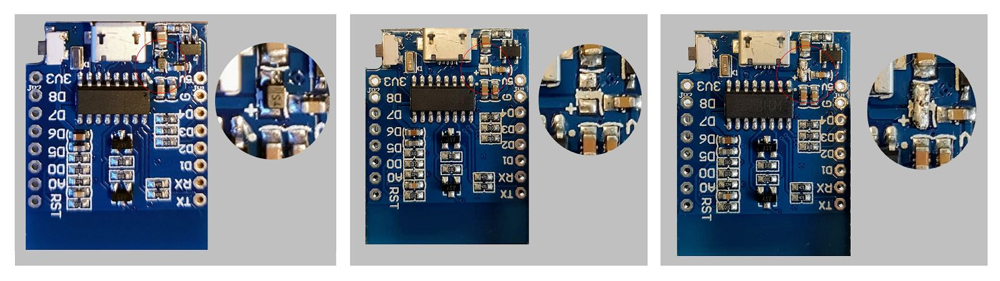

The flash button is easily added: just solder a button between GND and D3.
I rely on the internal pull up, to have the input high when the button is not pressed.
I added a small board and soldered extra wires, just for mechanical strength;
we are going to push that button, and the mounting holes are in the Wemos board.

Finally I drilled holes next to the ESP8266 module.
See below the end result of my mods.

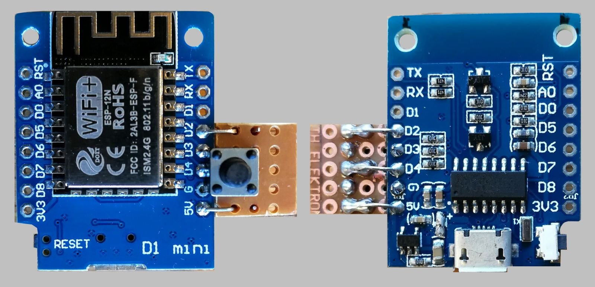


## 11. Model 4

We need to hook the NeoPixel board to our modded Wemos mini.
I originally did not intend to, but I did, in the end, add a level shifter.
The breadboards suggested it was not necessary, the data sheet said it was.
I played safe, a [level shifter](https://www.aliexpress.com/item/1972789887.html) 
is not that expensive, the bigger problem was putting all the electronics together;
I did not yet feel like making a PCB myself.

This is the schematics I came up with - do note that I replaced the diode with a
wire as described in [modding](#modding-the-board).

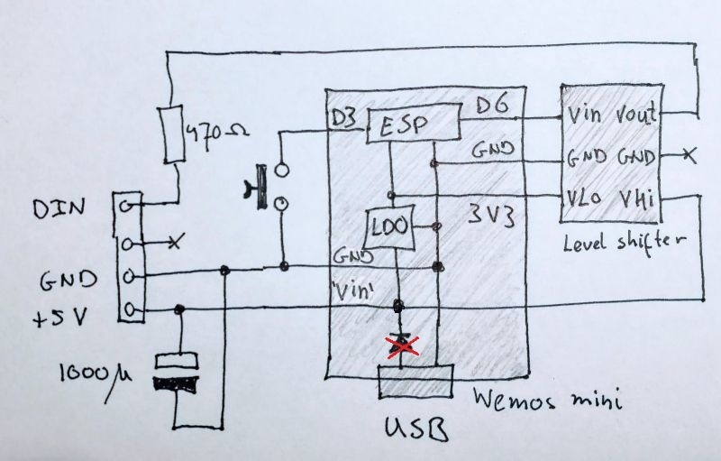

I added the level shifter in a similar manner as that I added the expansion board for the button.
But this boards has no mechanical stress, so I used only two wires to tie it to the ESP board.

I used the button expansion board (I should have made it bigger) for the other two components:
the resistor to protect the NeoPixels against over-voltage and the capacitor
to mitigate current swings (when the whole NeoPixel board switches on).
See [Adafruit](https://learn.adafruit.com/adafruit-neopixel-uberguide/basic-connections)
for details on these two components.

I added one more "component" on the button expansion board: a four pin header as
the connector towards the NeoPixel board. Pin three is a dummy, so that the connector
can not be inserted up-side-down. The resulting board, the Wemos mini with the two 
expansion boards, is shown in the photo below.

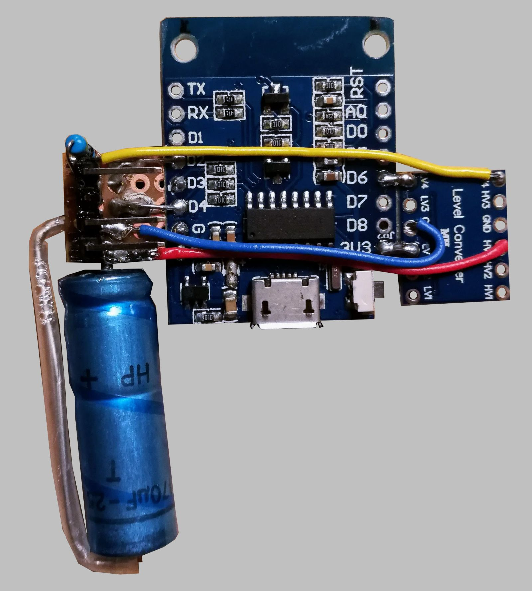

Next step is to fit this board in a 3D printed case. Of course, we already had the
[front side](#3d-printing), but I still needed to make the [back side](https://a360.co/2P95Akd).
In the figure below, we see the main board screwed to the back side (left). On the
right, the NeoPixel board is plugged into the board.

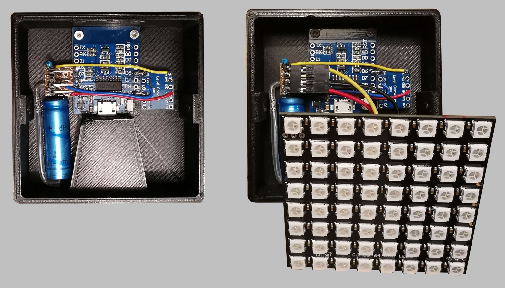

Below you find a photo showing the back of the device. 
We see (lower center) the recess for the USB plug.
On the top center, we find the light guide towards the LED and the 
hole where the FLASH button surfaces.

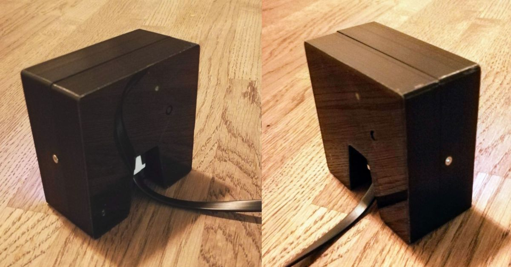

To test the electronics, I wrote a small Arduino [sketch](sketches/NeoPixelTest) that switches every LED
in every NeoPixel on. This allows us to see that the electronics works, and whether
all individual LEDs are OK. The photo below shows the fully assembled WordClock running
the self-test.

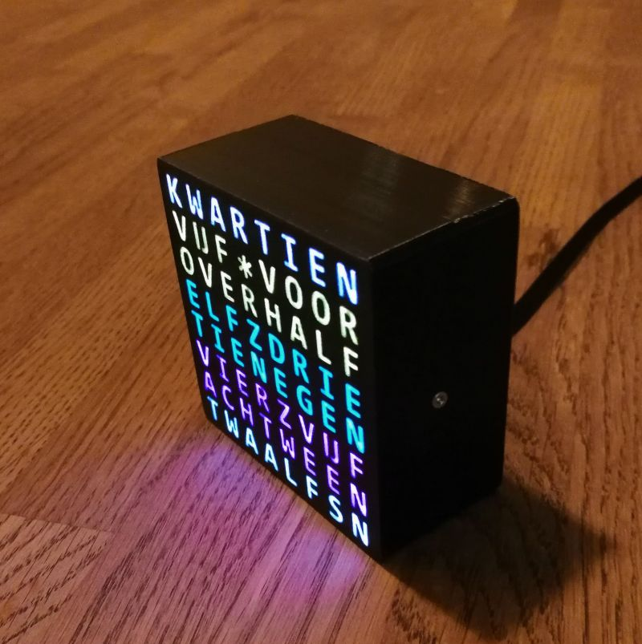

There is also a [video](https://youtu.be/40TDKY0Gjv4) of the device running the self-test.


## 12. Model 5

Mechanics is complete, let's now add the time keeping software.
I decided to make a "simple" version first.
No (dynamic) configuration, no animations.
Find this sketch in [WordClockSimple](sketches/WordClockSimple).

Here is a [video](https://youtu.be/0UkmPO7tGsg) looking at the case, LED, back and front.

Here is a [video](https://youtu.be/4AUioVwlsqg) with the clock running, comparing it to a DCF77 clock.

Some notes on the video
 - The blue LED at the back switches on the clock is powered (and initialized).
 - The blue LED switches off as soon as an NTP sync has occurred, i.e. when the local time is known.
 - The time is then displayed in 5 min resolution.
 - At 10:52:30 (see the DCF77 clock) the WordClock switches from 10:50 (TIEN-VOOR-ELF) to 10:55 (VIJF-VOOR-ELF).

By the way, I made the choice that time is rounded up (instead of floored). 
See the following animation (made in [python](scripts/clock2.py)) for the difference.

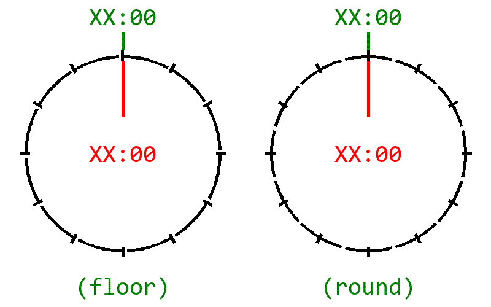

If you don't like that 10:52:30 is rounded up to 10:55, ..., it's just a `#define` in the code (`CLK_ROUND`).

Find below the output generated over Serial (when there are `...`, I removed lines)

```
main: WorkClockSimple v1

neo : init
led : init
clk : init
wifi: init

clk : 1970-01-01 09:00:00 (dst=0) [no NTP sync yet]
clk : 1970-01-01 09:00:01 (dst=0) [no NTP sync yet]
clk : 1970-01-01 09:00:02 (dst=0) [no NTP sync yet]
clk : 1970-01-01 09:00:03 (dst=0) [no NTP sync yet]
wifi: connected, IP address 192.168.179.102
clk : 2020-02-24 23:23:42 (dst=0) 23:26 vijf-voor-half-twaalf
clk : 2020-02-24 23:23:43 (dst=0) 23:26 
clk : 2020-02-24 23:23:44 (dst=0) 23:26 
clk : 2020-02-24 23:23:45 (dst=0) 23:26 
...
clk : 2020-02-24 23:24:27 (dst=0) 23:26 
clk : 2020-02-24 23:24:28 (dst=0) 23:26 
clk : 2020-02-24 23:24:29 (dst=0) 23:26 
clk : 2020-02-24 23:24:30 (dst=0) 23:27 vijf-voor-half-twaalf
clk : 2020-02-24 23:24:31 (dst=0) 23:27 
clk : 2020-02-24 23:24:32 (dst=0) 23:27 
clk : 2020-02-24 23:24:33 (dst=0) 23:27 
...
clk : 2020-02-24 23:25:27 (dst=0) 23:27 
clk : 2020-02-24 23:25:28 (dst=0) 23:27 
clk : 2020-02-24 23:25:29 (dst=0) 23:27 
clk : 2020-02-24 23:25:30 (dst=0) 23:28 vijf-voor-half-twaalf
clk : 2020-02-24 23:25:31 (dst=0) 23:28 
clk : 2020-02-24 23:25:32 (dst=0) 23:28 
clk : 2020-02-24 23:25:33 (dst=0) 23:28 
...
clk : 2020-02-24 23:26:27 (dst=0) 23:28 
clk : 2020-02-24 23:26:28 (dst=0) 23:28 
clk : 2020-02-24 23:26:29 (dst=0) 23:28 
clk : 2020-02-24 23:26:30 (dst=0) 23:29 vijf-voor-half-twaalf
clk : 2020-02-24 23:26:31 (dst=0) 23:29 
clk : 2020-02-24 23:26:32 (dst=0) 23:29 
clk : 2020-02-24 23:26:33 (dst=0) 23:29 
...
clk : 2020-02-24 23:27:27 (dst=0) 23:29 
clk : 2020-02-24 23:27:28 (dst=0) 23:29 
clk : 2020-02-24 23:27:29 (dst=0) 23:29 
clk : 2020-02-24 23:27:30 (dst=0) 23:30 half-twaalf
clk : 2020-02-24 23:27:31 (dst=0) 23:30 
clk : 2020-02-24 23:27:32 (dst=0) 23:30 
clk : 2020-02-24 23:27:33 (dst=0) 23:30 
```

Notes on the output
 - The first line identifies the program and version.
 - The next 4 lines signal the initialization of the hardware blocks (`setup()`).
 - Then the device is operational (switches to `loop()`).
 - We see that the first couple of seconds, there is no WiFi yet.
 - The WiFi connect occurs, and we see the assigned IP number.
 - Quickly after that, we have the first NTP sync, and the clock knows local time.
 - As output we see `clk : 2020-02-24 23:23:42 (dst=0) 23:26 vijf-voor-half-twaalf`
    - The `clk` identifies the "driver" that prints the message.
    - The `2020-02-24 23:23:42 (dst=0)` is the full (local) date and time locally known,  
      also see we do not yet have daylight saving (`(dst=0)`).
    - The `23:26` is the "rounded-up" time (since we have a resolution of 5 min, 2.5min is added).
    - Each time when hours or minutes change, the display is updated, the text `vijf-voor-half-twaalf` shows which NeoPixels
 - At 23:24:30 there is another minutes change (to `23:27`) and the display is refreshed to `vijf-voor-half-twaalf`.
 - At 23:25:30 there is another minutes change (to `23:28`) and the display is refreshed to `vijf-voor-half-twaalf`.
 - At 23:26:30 there is another minutes change (to `23:29`) and the display is refreshed to `vijf-voor-half-twaalf`.
 - At 23:27:30 there is another minutes change (to `23:30`), so now the display is updated to `half-twaalf`.


## 13. Model 6

The hardware is done, the clock is running.
The final step is to add software features.
The application [WordClockFull](sketches/WordClockFull) is the end-user application.
It contains the following features

 - Color modes 
   The colors used for the hours and minutes can be configured.
   What's more, the color __mode__ can be configured: fixed, cycling or random.
   And the refresh can be every 5 minutes (when the text changes) but also every minute (to have the clock more lively).
   
 - Display animations 
   When the time changes, the display is refreshed. This might mean that the time is drawn in a different color
   (see previous feature: color mode). It is also possible to animate the "old time text"
   to the "new time text". The app has five animations built in: none, wipe, dots, pulse and mist.
   
 - Demo mode 
   To show off the clock (the color modes and display animations) there is now a demo mode.
   By pressing the (flash) button, the clock starts running at 15× speed.
   
 - A configuration interface 
   When powering the WordClock, you have some time to press the (flash) button of the ESP8266.
   If you do that, the actual clock app will not start, instead the configuration app starts.
   This means the ESP8266 starts a WiFi access point (plus DNS and DHCP server), and a web server.
   When you connect to the web server with a laptop or smart phone, you get a web page with configuration parameters.
   Typical parameters are: the SSID and password of your home wifi network, the time zone, 
   the colors for the hours and minutes and the animations to be used.
   When you commit the configuration, they are stored persistently, and the clock app will use them (even after a power cycle).
   
 - A NeoPixel test 
   All LEDs in all NeoPixels are switched on one by one, to test if they are working.


## 14. User manual

The Dutch WordClock running the [WordClockFull](sketches/WordClockFull) firmware has the 
following characteristics.

### Hardware
On the front site, we have 8×8 letters with RGB LEDs behind them.
They form words that tell the time.
This clock is made for the Dutch language.

At the back site there are three user parts.
There is the signaling LED, a user button and a micro USB connector.

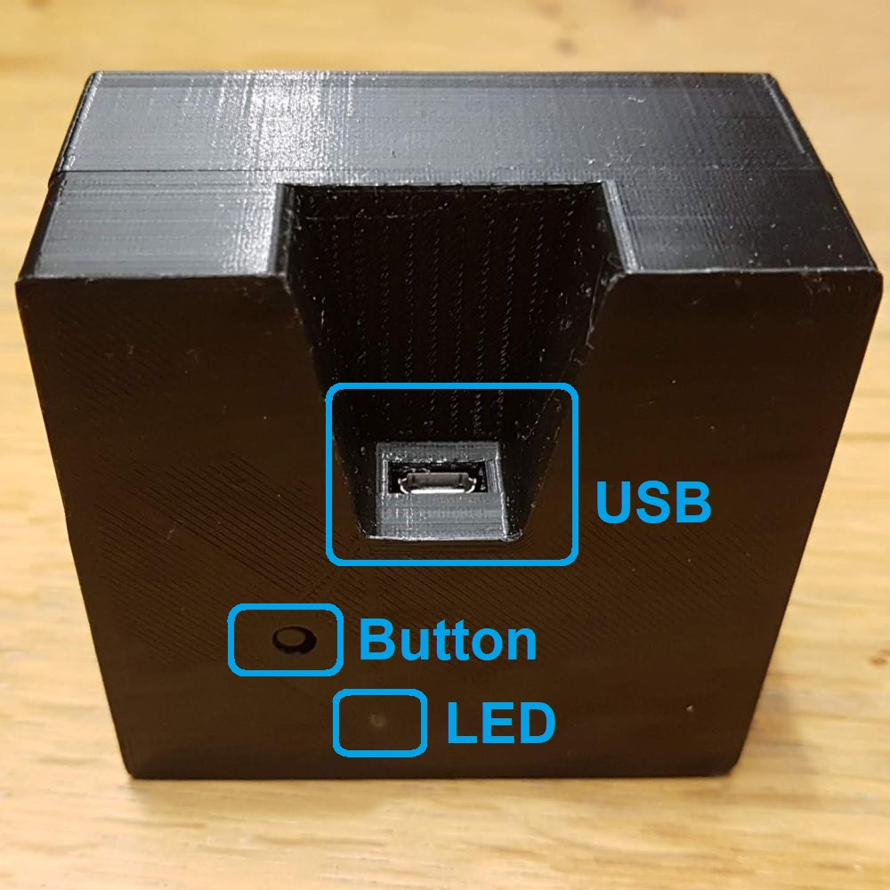

The signaling LED has two functions, described in more detail in the software chapter.
Firstly, at startup, it blinks rapidly to signal that the user can press the button to enter configuration mode.
When running the clock app, the signaling LED should be off (indicating WiFi connected and thus correct time).
When the signaling LED is on this indicates that the WordClock is searching for a WiFi net to connect to.

The button als has two functions.
Firstly, at startup, when the signaling LED is blinking, a press on the button enters configuration mode.
When running the clock app, pressing the button toggles between normal clock mode and demo mode (15× speed).

Finally the USB connector has dual use.
Its main use is power supply to the WordClock.

The power usage can be estimated as follows, see also the section on [power](#9-Power-architecture).
Let's assume the display shows 17 characters (TIEN VOOR HALF NEGEN), 
each in a primary color (red, green, blue), and each at 20%.
This comes close to the default configuration.
Recall that a 100% powered LED consumes 13mA, the 64 NeoPixels have standby current of 32mA and the ESP8266 NodeMCU
uses 80mA. This results in an operating current of 20% × 13 × 17 + 32 + 80 ≈ 156 mA.
This is well within standard USB specification, which says 500mA max.

The mist animation switches nearly all pixels on, to grey.
The default mist color has 0x222222, which means 0x22 or 34 per color channel. This is 13% of full power.
During mist, the pixels vary from 13% to 0%,so let's estimate 7% average.
This means the power would be 7% × 13 × 50 × 3 + 32 + 80 ≈ 250 mA.
Still half of max.

This figures match quite well with actuals. We measure 148 where we estimated 156, and we measure 247 where we estimated 250.

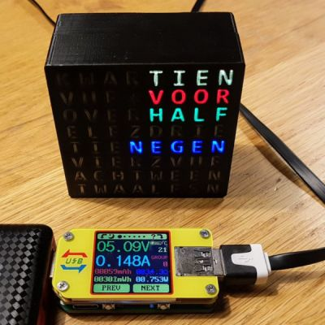  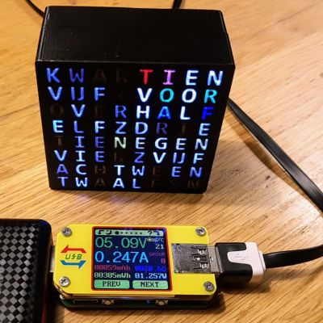

The second use of the USB connector is software development.
When the USB connector is connected to a PC, and a CH340 USB to serial driver is installed, 
and you have a terminal program (115200/8/N/1) we can have a look at the WordClock log.
You get something like this

```
main: WordClockFull v5                                                          
                                                                                
Cfg: Press button on pin 0 to enter configuration mode                          
main: No configuration requested, started WordClockFull                         
                                                                                
neo : init                                                                      
neo : tested                                                                    
but : init                                                                      
led : init                                                                      
wifi: init: GuestFamPennings MaartenAP dePracht                                 
clk : init: pool.ntp.org europe.pool.ntp.org north-america.pool.ntp.org         
clk : timezones: CET-1CEST,M3.5.0,M10.5.0/3                                     
clk : round: 150 sec                                                            
ltrs: init                                                                      
col : palette: 120000 001200 0C0C00 000018 222222                               
col : max: R12 G12 B18                                                          
col : modes: one cycle mist                                                     
anim: init                                                                      
                                                                                
clk : 1970-01-01 09:00:05 (dst=0) [no NTP sync yet]                             
clk : 1970-01-01 09:00:06 (dst=0) [no NTP sync yet]                             
clk : 1970-01-01 09:00:07 (dst=0) [no NTP sync yet]                             
wifi: connected to GuestFamPennings, IP address 192.168.179.102                 
clk : 1970-01-01 09:00:08 (dst=0) [no NTP sync yet]                             
clk : 2020-03-15 20:31:13 (dst=0) 20:33 (mist) half/0C0C00 negen/120000         
clk : 2020-03-15 20:31:14 (dst=0) 20:33                                         
clk : 2020-03-15 20:31:15 (dst=0) 20:33                                         
anim: mist - stop (2360 ms)                                                     
clk : 2020-03-15 20:31:16 (dst=0) 20:33                                         
clk : 2020-03-15 20:31:17 (dst=0) 20:33                                         
clk : 2020-03-15 20:31:18 (dst=0) 20:33                                         
clk : 2020-03-15 20:31:19 (dst=0) 20:33                                         
clk : 2020-03-15 20:31:20 (dst=0) 20:33                                         
clk : 2020-03-15 20:31:21 (dst=0) 20:33                                         
clk : 2020-03-15 20:31:22 (dst=0) 20:33                                         
clk : 2020-03-15 20:31:23 (dst=0) 20:33                                         
clk : 2020-03-15 20:31:24 (dst=0) 20:33                                         
clk : 2020-03-15 20:31:25 (dst=0) 20:33                                         
```    

Maybe more important, the USB connector can be used to upgrade the firmware.

### Install firmware

This section is deliberately short. There are plenty of sites explaining how to install Arduino apps, 
even from [myself ](https://github.com/maarten-pennings).

Download and install [Arduino IDE](https://www.arduino.cc/en/Main/Software) and then the 
[ESP8266 compiler and libraries](https://www.instructables.com/id/Quick-Start-to-Nodemcu-ESP8266-on-Arduino-IDE/).

Download the [WordClockFull][sketches/WordClockFull].
It does need the [configuration library](https://github.com/maarten-pennings/Cfg)
and the [persistent storage library](https://github.com/maarten-pennings/Nvm)

The libraries need to be stored in the Arduino library directory
(mine is here `C:\Users\Maarten\Documents\Arduino\libraries`) and the WordClock app
itself can be stored anywhere, but most people store it in the Arduino directory
(thus `C:\Users\Maarten\Documents\Arduino\` for me).


### Normal operation

When the WordClock is powered it should start with a blank display.
Sometimes it powers with the display showing the last time; this is due to the large internal capacitor
which helps the NeoPixel display to retain state. But it will be switches off immediately.

After power up, the WordClock first gives the user the options to enter configuration mode.
Entering configuration mode is achieved by pressing the button at the back while the signaling LED at the back is blinking.
If the button is not pressed during the blinking (which takes about one second), the WordClock app starts.
We will describe that first. Configuration mode is described [below](#configuration).

The WordClock app starts with the signaling LED on. This indicates the WordClock has no WiFi connection (yet).
The first step of the WordClock app is a NeoPixel test: all red LEDs are turned on one-by-one, then all green LEDs and finally
all blue LEDs. 

After the NeoPixel test finishes, the display blanks. The display stays blank until time is known.
For this, the WordClock needs to connect to WiFi. Once that is successful, the signaling LED switches off (normal state).
Next step is to sync with NTP services. If that is successful, WordClock knows time, and shows that on the display.

If later, the WiFi connection is lost, the signaling LED switches on again (until the next WiFi connect).
When there is no WiFi, there is no NTP sync. But once time has been synced, the internal processor
keeps track of time itself (with a drift of ±1s per day). NTP syncs occur once per hour (if WiFi is connected).

There is one feature while running: the button at the back toggles demo mode.
In demo mode, time runs at 15× speed. This shows off the animations.
Demo mode starts with current time, but quickly deviates because it runs faster.
When the button is pressed again, demo mode is off, and the clock shows the real time again.

When the WordClock is correctly configured, it will also switch to daylight saving time 
and back to standard time at the correct moment.

Note that the WordClock app logs all steps over the UART connection, which is available over USB.


### Configuration

When the user presses the back button at power up (with the signaling LED blinking fast) the WordClock enter configuration mode.
WordClock starts and WiFi Access Point, a DNS server, DHCP server and a web server.
Once the web server is running, the signaling LED will blink slowly (1Hz) showing configuration mode is active.

Connect your laptop or smart phone to this Access Point.
The SSID starts with WordClock, and is followed by a part of its MAC address.

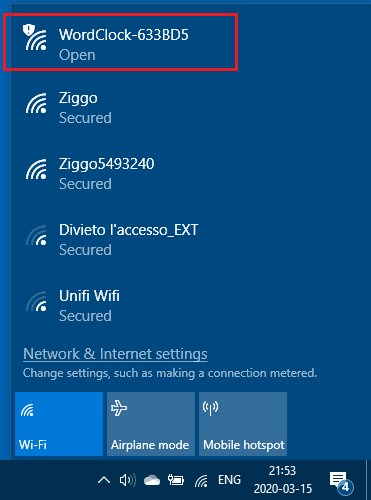

Start a browser (on your laptop of smart phone) and visit site 10.10.10.10.
You will get the configuration page.

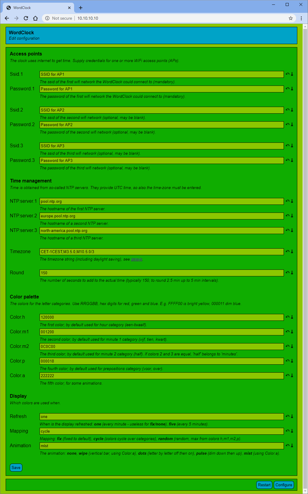

The configuration page consist of sections. Each section contains fields.
Each field has a name (like `Round`), a value (like `150`), and some help 
(`The number of seconds to add to the actual time (typically 150, to round 2.5 min up to 5 min intervals).`)
At the end of each field you find two arrows: an undo arrow, which undoes all edit action and reverts to the current value.
The down error reverts to the default of the field.
Once you have entered all configuration settings to you liking, press `Save`.
The settings will be saved persistently, and the WordClock restart.

The first section is **Access Points**. 
Here you can enter up to three access points; the SSID (`Ssid.1`, `Ssid.2`, and `Ssid.3`) and 
the associated passwords  (`Password.1`, `Password.2`, and `Password.3`) .
I typically enter home, work, and the tethering AP of my phone.
If you have fewer than three, just leave them blank.
 
The next section is **Time management**. 
Here you type the host name of three NTP servers (`NTP.server.1`, `NTP.server.2`, and `NTP.server.3`). 
Probably the default servers are ok.
The `Timezone` field defines standard timezone you want (with respect to UTC).
It also defines the daylight saving timezone (DST) and when it starts and stops.
The syntax of this field is described [here](https://www.gnu.org/software/libc/manual/html_node/TZ-Variable.html).
The `Round` field ads seconds to time to do the rounding up. See details [above](#12-model-5).

The third section is **Color palette**. 
All fields should have 6 hexadecimal digits (0..9, A..F), with two digits for red, tow for green and two for blue.
The first color (`Color.h`) is used for the hours text.
The second color (`Color.m1`) is used for the minutes ("vijf", "tien", "kwart").
The third color (`Color.m2`) is used for the word "half".
The fourth color (`Color.p`) is used for the prepositions ("voor" and "over").
If `Color.m1` and `Color.m2` are equal, "half" will always be colored the same as "vijf", "tien" and "kwart" (in "cycle" and "random" mapping).
If mapping is "random", the RGB components of the generated random colors will always be 
below the ones of (`Color.h`, `Color.m1`, `Color.m2`, `Color.p`).
The last color (`Color.a`) is used for animations that need an extra color (wipe and mist).

The last section is **Display**. 
This section determines the animations.
`Refresh` is either "one" or "five". It determines how often the display is refreshed:
either every minute ("one") or every five minutes ("five").
Note that only ever five minutes the time reading changes.
So selecting "one" makes no sense when mapping is "fix" and animation is "none".
`Mapping` determines colors used for the words. "fix" uses the colors as defined in the color palette section.
The "cycle" mapping also uses the colors, but every refresh the colors are cycled.
Finally, the "random" mapping generates random colors for the words (never duplicates, never black).
The `Animation` setting determines the animation for every refresh.
The ["none"](https://youtu.be/OCgUQ6qWnN4) animation instantly removes the old time and adds the new time.
The ["wipe"](https://youtu.be/U9yd8xaslh4) animation moves a columnc from left to right erasing the old time before it and adding the new time behind it.
The ["dots"](https://youtu.be/AXKME2LGA_A) removes the old time one pixel at a time, then adds the new time one at a time.
The ["pulse"](https://youtu.be/F0VIralrmUM) animation dims the old time down, then dims the new time up.
Finally, the ["mist"](https://youtu.be/u285F07go_c) animation covers the old time be adding mist pixels, then uncovers the new time by removing mist pixels.


(end)
