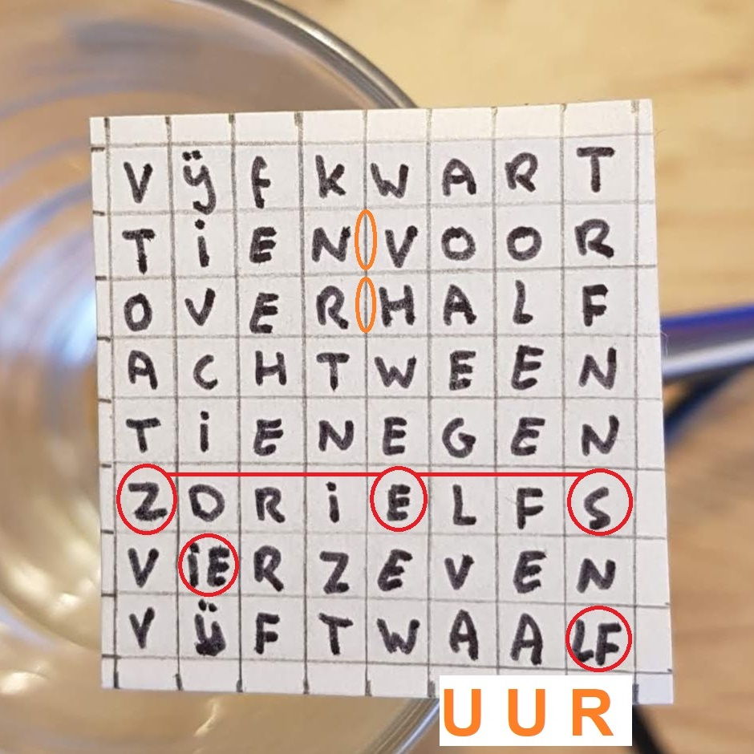
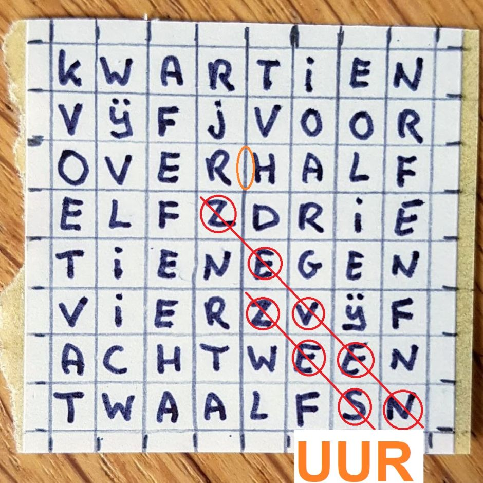

# WordClock
A clock that tells time in plain text

## Introduction
I got the idea from [here](http://www.espruino.com/Tiny+Word+Clock).
It uses a simple 8x8 LED matrix, so very little mechanics to do.

## Model
I made a Dutch version. Modelling all the words on 8x8 is not easy: I decided not to allow vertical texts, so 
I did have to cheat:

 - two paired letters vIEr and twaaLF
 - one split word Z-E-S
 - less of a problem: two times a space missing and the word UUR missing

Marc made another model. He allows diagonal words, thereby eliminating the paired letters and split words.

## Prototype
First prototype was made with an ESP8266.
I made a [video](https://www.youtube.com/watch?v=YDhCZarNm9g) that runs 
at approximately 600x so that all states appear in a one minute movie.

I also made a [real clock](WordClock) and a
[video](https://youtu.be/wVqeRSxwd_Y) that captures one state change.
This really keeps the time (based on the ESP8266 crystal).
At startup the user can press the FLASH button to set the hour and minute.

The next version of uses the second words model (Marc's).
At startup you can not only set hour and minute, but also mode: clock or a fast demo.
Here is the video of the [fast mode](https://www.youtube.com/watch?v=LO9IB6KRluM).

