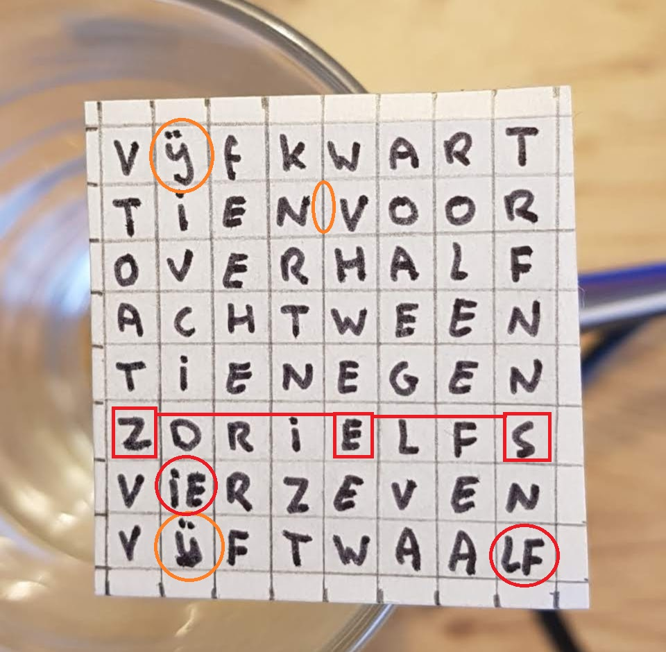

# WordClock
A clock that tells time in plain text

## Introduction
I got the idea from [here](http://www.espruino.com/Tiny+Word+Clock).
It uses a simple 8x8 LED matrix, so very little mechanics to do.

I made a Dutch version. I decided not to allow vertical texts, but I did have to cheat to fit all the words on 64 LEDs.

## Prototype
First prototype was made with an [ESP8266](WordClockDemo).
I made a [video](https://www.youtube.com/watch?v=YDhCZarNm9g).

