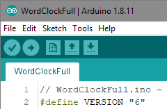
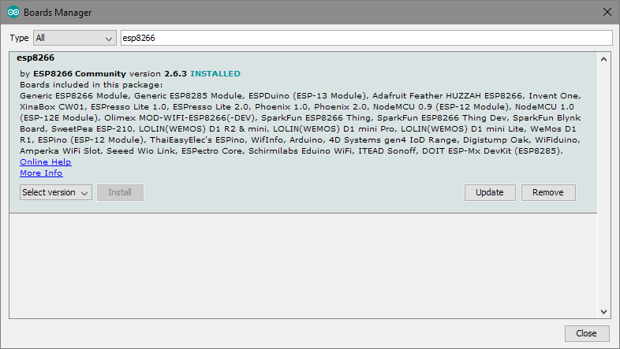
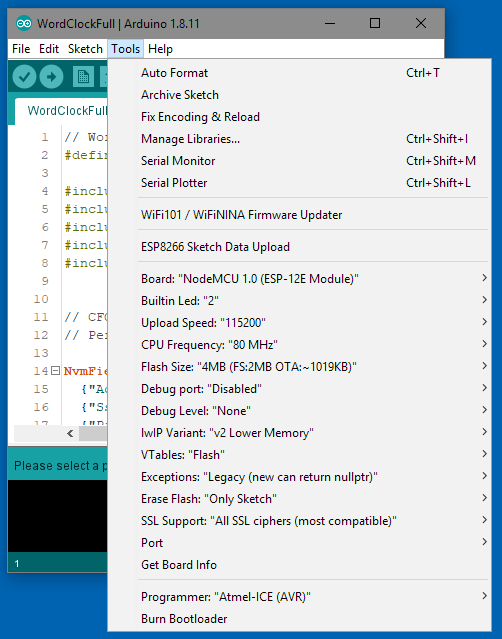
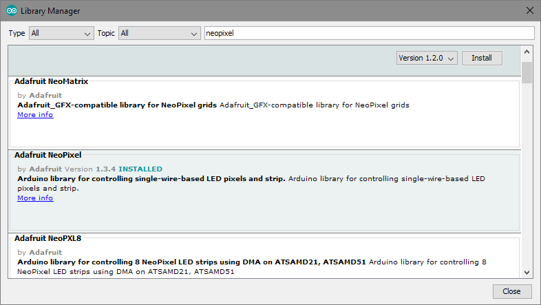
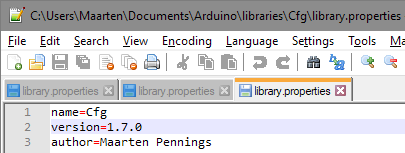
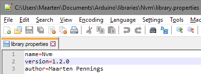

# Release

This directory contains a binary release of WorClockFull.
This should make it easier to flash your own.

## How to flash

The easiest way to flash the binary is to use my [flash tool](https://github.com/maarten-pennings/flasher).
It is a batch file around the official flasher `esptool` for the ESP8266 (note, the `esptool` has been superseded by something newer).

- Download the flasher tool into a directory on your PC
- Copy the [`WordClockFull.ino.bin`](WordClockFull.ino.bin) into the same directory
- Run the batch file (e.g. double click it)

## Versions

The binary was made with the Arduino IDE.
The following ingredients were used

- Arduino IDE 1.8.11  
  
- ESP9266 board 2.6.3  
  
- Node MCU 1.0 (ESP-12E Module), ...  
  
- NeoPixel 1.3.4  
  
- Cfg 1.7.0  
  
- Nvm 1.2.0  
  

(end of doc)