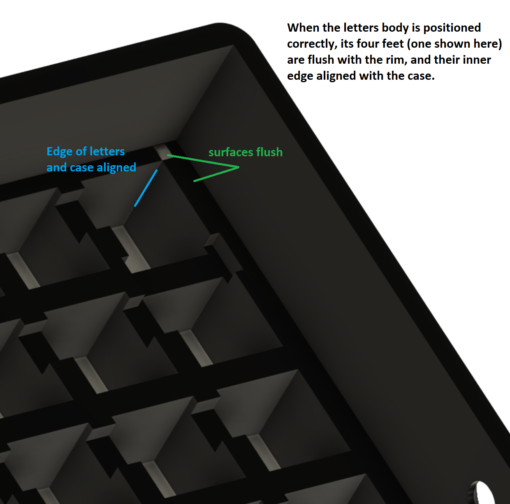
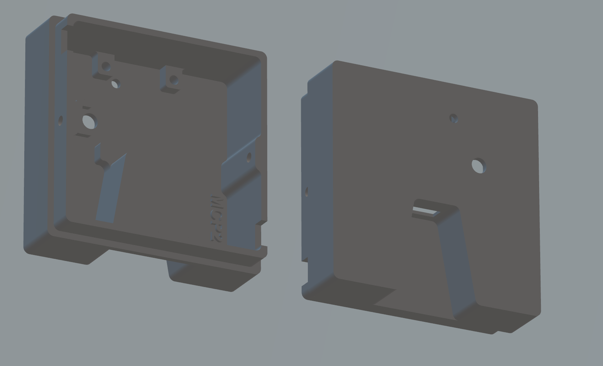
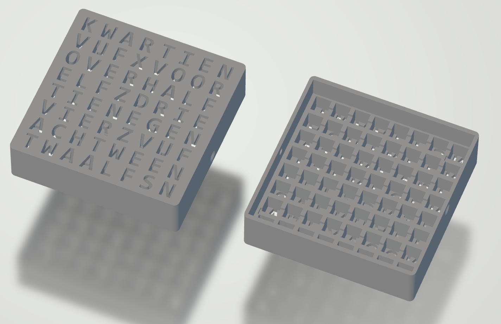
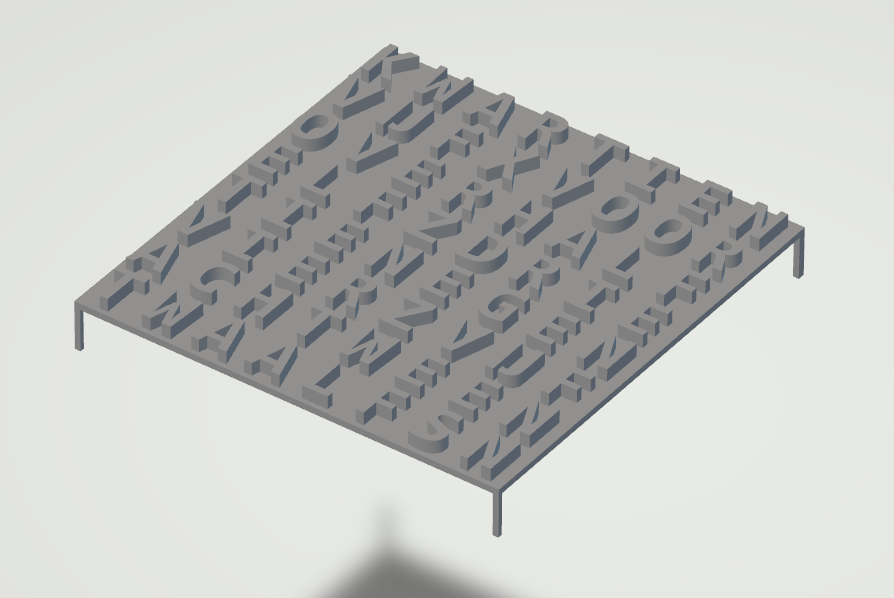
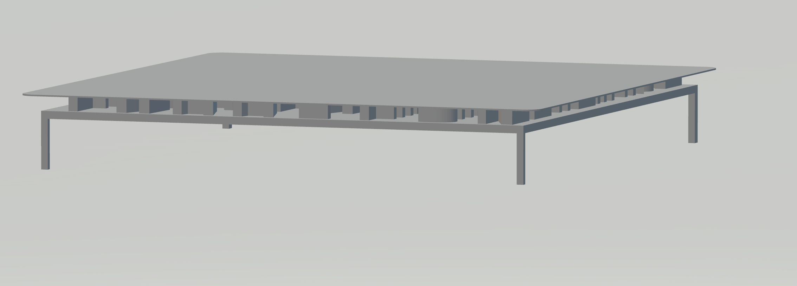

# WordClock - STLs

The STL files I made for the WordClock.

## Notes

The following STL files are available. See below for the clickable images.
 1. [Back of the box](WordClockBack-v13.stl)
 2. [Front of the box](WordClockFront-v13-box.stl)  
    The front is supposed to be printed with a two-nozzle printer. 
    One nozzle prints "black" (the case) and one nozzle prints "transparent" (the letters).
 3. [Letters](WordClockFront-v13-letters.stl)
 4. [Letters with front](WordClockFront-v13-letters-withfront.stl)  
    Alternative for 3; the letters have an additional transparent front plane.
 5. [Front of box + Letters in STEP](WordClockFront-v13.step)  
    Alternative for 2+3 together in STEP format.

When setting up the "front of box" print job: see here how to align the case with the letters.

## Back (of the box)

## Front (of the box)

## Transparent letters on diffuser

## Transparent letters on diffuser (with extra front pane)

(end)
